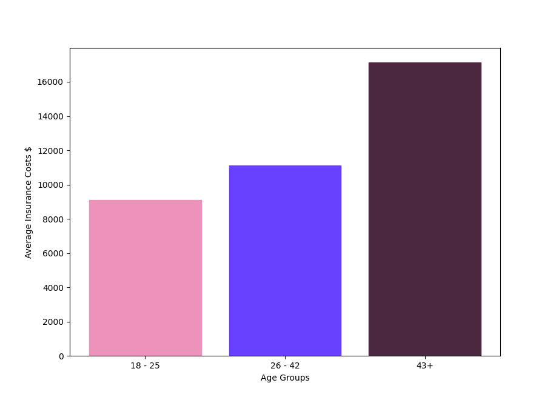
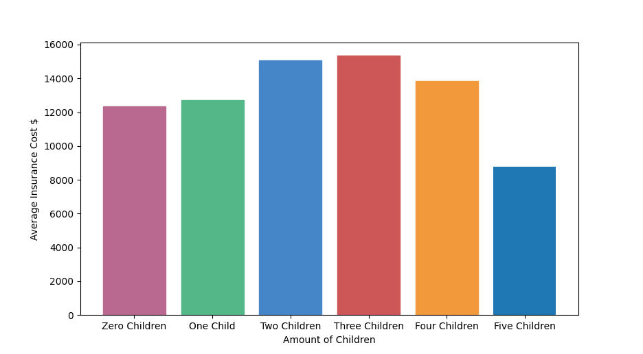

# Medical Insurance Analysis
### Utilizing Python to analyze insurance trends in a large CSV data set

## Finding the average price of insurance for different age groups:
The average younger age group insurance cost = **<em>$9087.015806924835</em>**   
The average middle age group insurance cost = **<em>$11128.035132293986</em>**  
The average older age group insurance cost = **<em>$17116.14130264151</em>**  

**From this data, we can assume that the older the person is the more expensive their insurance will be.**

## Finding the average price of insurance for males and females:
The average male insurance = **<em>$13956.751177721893</em>**  
The average female insurance = **<em>$12569.578843835347</em>**  

**From this data, we can assume that males insurance cost may be a bit more expensive than females**

## Finding the average price of insurance for healthy, overweight, and obese BMIS:
The average healthy insurance = **<em>$10459.367814525862</em>**  
The average overwiehgt insurance = **<em>$11071.833836072785</em>**  
The average obese insurance = **<em>$15560.926321262412</em>**  

**From this data, we can assume that there is a positive correlation between a person's BMI and their insurance cost**

## Finding the average price of insurance for different amounts of children
The average zero children insurance =  **<em>$12365.975601635888</em>**  
The average one child insurance =  **<em>$12731.171831635802</em>**  
The average two children insurance = **<em>$15073.563733958332</em>**  
The average three children insurance = **<em>$15355.318366815285</em>**  
The average four children insurance = **<em>$13850.6563112</em>**  
The average five children insurance = **<em>$8786.035247222222</em>**  

**From this data, we can assume that there is not much correlation between the amount of children a person has and their insurance cost**

## Finding the average price of insurance for smokers and non-smokers:
The average smoker insurance = **<em>$32050.23183153285</em>**  
The average non-smoker insurance = **<em>$8434.$268297856202</em>**  

**From this data, we can assume that there is a strong correlation between smokers and expensive insurance cost**

## Finding the average price of insurance for different regions:
The average Northeast insurance =  **<em>$13406.384516385804</em>**  
The average Northwest insurance =  **<em>$12417.575373969232</em>**  
The average Southeast insurance =  **<em>$14735.41143760989</em>**  
The average Southwest insurance =  **<em>$12346.937377292308</em>**  

**From this data, we can assume that there is not much correlation between different regions and their insurance cost**

